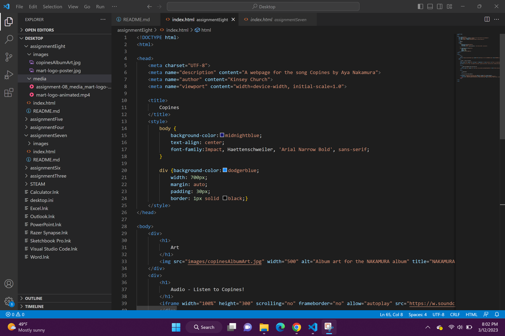

An affordance is essentially a way in which something can be used. In terms of digital affordances, they are more defined and limited than real-world affordances. For example, the power button icon's affordance is to turn something on or off.

The advantages of using a third-party service such as YouTube or Vimeo to host your videos aren that they are ideal for video and audio files, they can host large, high-quality versions of files, and they will handle compatibility, encoding, and the other details necessary for the media to play on different browsers so you don't have to.

The disadvantages of using a third-party service such as YouTube or Vimeo to host your videos are that they are not ideal for image files, any unlicensed materials used without permission can be crawled and reported, and they can become costly to upgrade storage and/or services.

