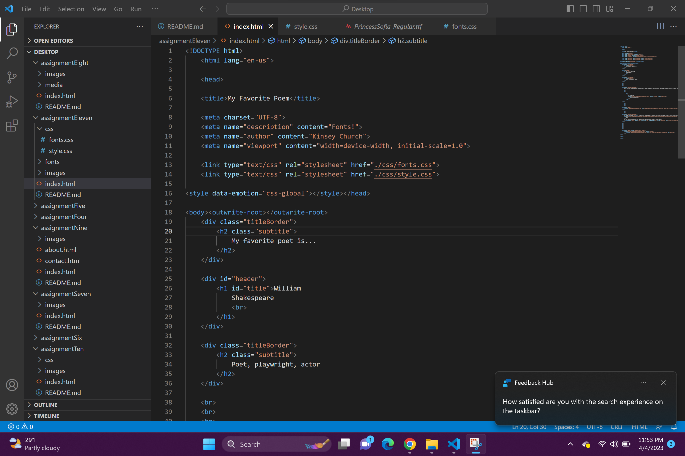

Typography is essentially a font. It is the style and appearance of text. 

The importance of having fallback fonts or a font stack is to have a backup list of fonts for the website to load in case for whatever reason the original font is unable to load. It allows the viewer to be able to read the information even if the original font has failed. 

What is the difference between a system font, web font, and web-safe font?
A system font is a font that has already been installed on your local device and system. They are available for free to use with most programs, but not always on the web due to licensing. A web font is a custom font hosted on a server. They don't have to be on the user's device to show up, but they do require certain elements work and show up correctly. They work the best on the web, but they are not foolproof and you should take into consideration browser compatibility, rendering speeds, and availability when using these fonts.
A web-safe font is a font that developers depend on being available by the system. Using these fonts means that the computer will already have the font and there will be reduced load times and possibly have increased performance.

