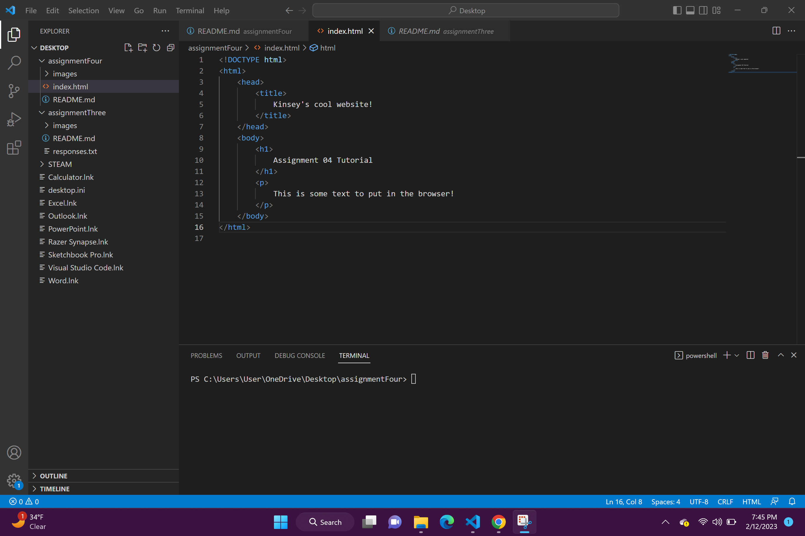

Browsers translate and render instructions from web languages like HTML, CSS, and JavaScript into the intended layouts of text, graphics, and other content.

Some browsers I use are Google Chrome, Microsoft Edge, and Safari.

