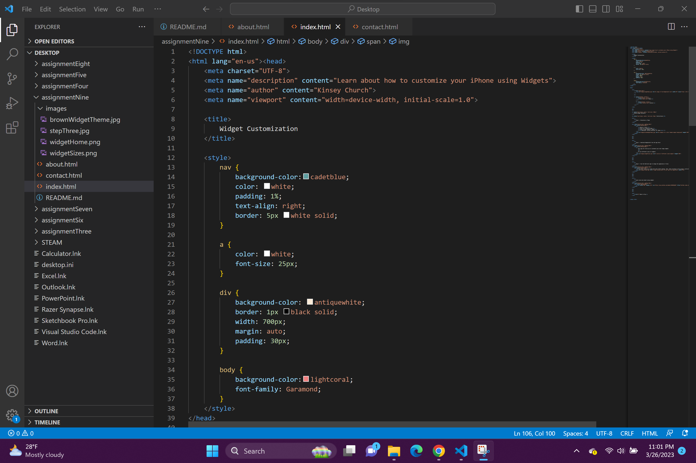

Learning about HTML has been super fascinating. I really didn't know much about it before taking this class, other than the fact that sometimes it was at the end of a web address. The styling elements that can be added to the HTML files were very fun to learn about. It was also interesting to me that you could have the different .HTML files (i.e. about, contact, index, etc...)

I am a more visually oriented person, so I am excited to learn about CSS to get more creative with websites.

