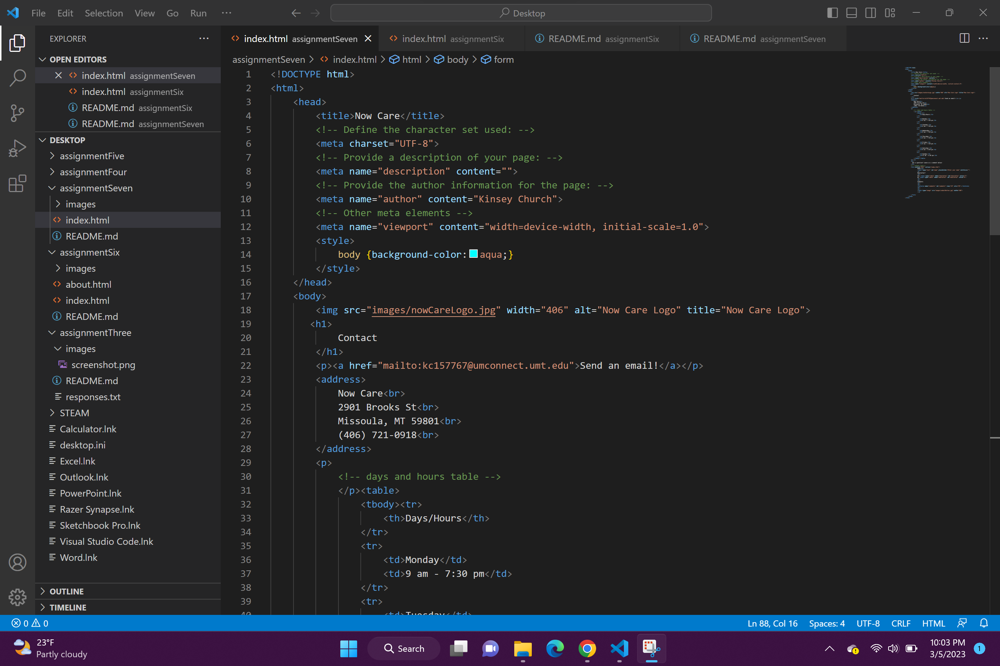

I use forms every time I log-in to Moodle or Cyberbear when I enter my username and password. I also use forms when completing Google Searches or filling out a Google Form. The purpose of forms is to collect data and information from users on websites.

