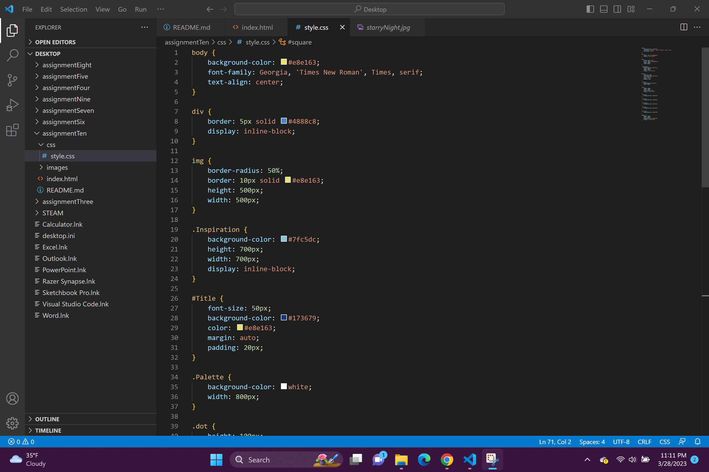

A universal selector type is used to select every single element on a page. An element selector type is used to select elements of a specific type. You select a name for the specific element. A class selector type allows you to select elements that serve the same function. An id selector type allows you to select a specific singular element by it's name. They should only be used once. You might choose the id selector if you want to change a specific element's font or size without changing anything else. You may select the class selector if you want to change the color of several elements in one try. You may select the element selector if you are changing apsects of a title. You might use the universal selector if you are looking to change everything all at once. 

My color palette is comprised of mostly cool toned blues and then a warmer yellow to mimic Vincent Van Gogh's Starry Night painting. It is one of my favorites. Blue is also my favorite color.

