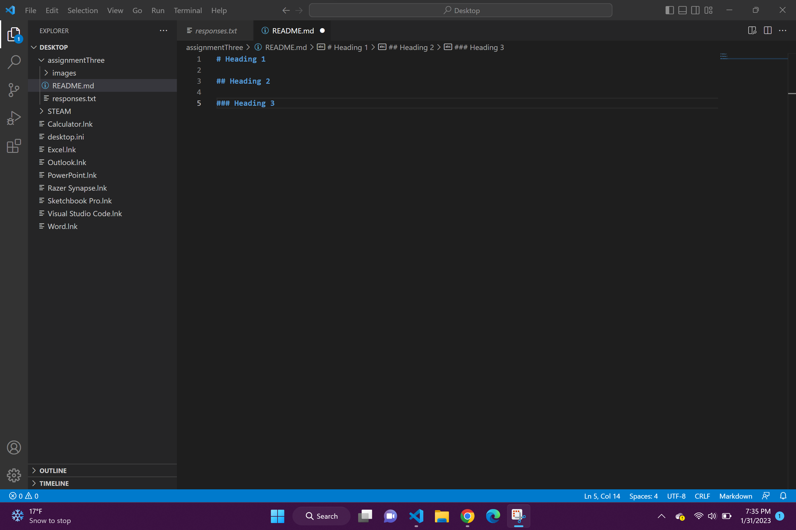

# Heading 1

## Heading 2

### Heading 3

In this class I have learned that the word "internet" comes from the original word "internetwork." I have also learned that PNG stands for "Portable Network Graphics" and I've learned some basic computer coding as well, such as the #s above.

[Stratford Shakespeare Festival](https://www.stratfordfestival.ca/WhatsOn/PlaysAndEvents/Production/Loves-Labours-Lost)

[My File](./responses.txt)

