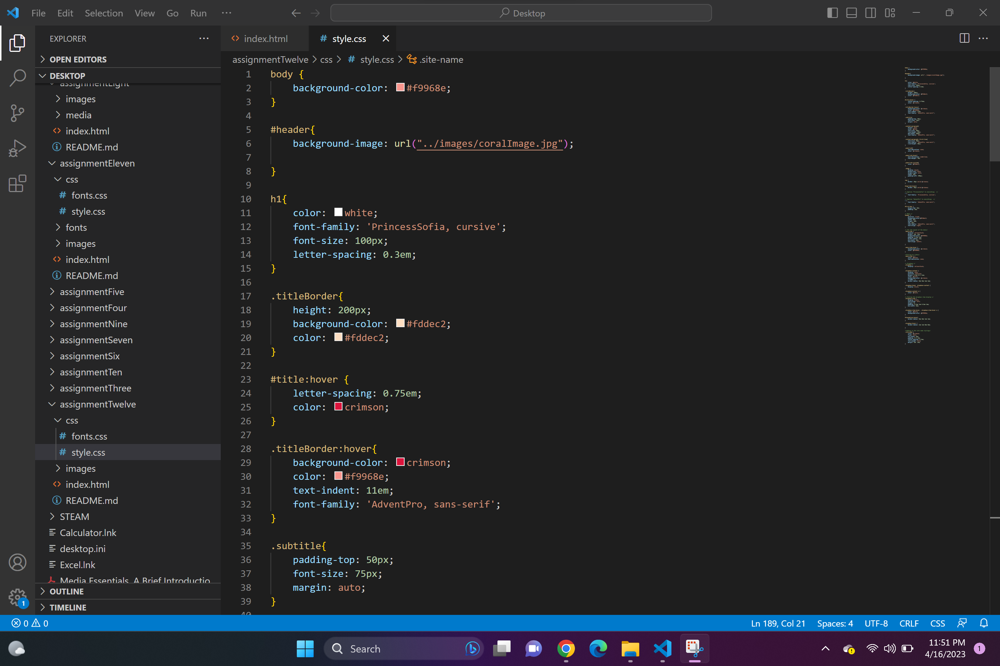

What is the difference between padding, margin, and borders?
Padding is is the amount of space between the inner content of the element and the element itself. 
Margins are the space between the box/element and other elements, or the edge of the parent element.
Borders help define the amount of space a box or element takes up, as well as its relationship to other boxes.
Borders can be separately colored, and have multiple style options. Borders are more for visuality than space needs.
There are three properties that comprise Borders:
- Width
- Style
- Color

